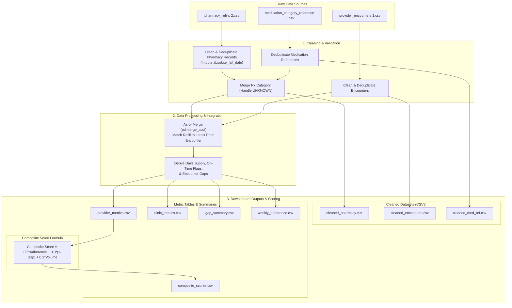

# ⚕️ MY DR NOW – Medication Adherence Analytics Pipeline

[](https://www.python.org/)
[](https://pandas.pydata.org/)
[](https://plotly.com/)
[](https://scikit-learn.org/)
[](https://jupyter.org/)

An end-to-end Python-based data engineering and analytics pipeline designed to evaluate medication adherence for **MY DR NOW**. This repository implements a robust data quality audit, cleaning protocols, temporal mapping (matching patient refills to preceding clinical encounters), provider/clinic performance benchmarking, and a multi-criteria composite scoring model ready for integration with business intelligence tools (e.g., Power BI).

---

## 🗺️ System Architecture & Data Flow

The following Mermaid diagram outlines the data processing stages, ingestion points, merging logic, and downstream output structures generated by the pipeline:



---

## ✨ Core Features & Capabilities

* **Data Quality Auditing:** Automatic validation of data types, missing values, and patient ID formats (filtering non-numeric anomalies).
* **Date Imputation & Validation:** Coalescing missing `absolute_fail_date` values to corresponding `next_refill_date` targets and filtering out logical date conflicts.
* **Temporal Mapping (`as-of` merging):** Associates pharmacy refills with the most recent prior clinical encounter for the patient, enabling tracking of encounter-to-refill latency.
* **Provider & Clinic Benchmarking:** Calculates provider- and clinic-specific metrics (total refills, on-time refill rate, and average encounter-to-refill gap).
* **Workflow Timing & Gap Analysis:** Bins the days elapsed between clinical encounters and medication refills to examine how the timing of provider interaction correlates with patient adherence.
* **Multi-Criteria Composite Scoring:** Normalizes variables (via `MinMaxScaler`) to score provider performance based on a weighted combination of adherence rate, encounter frequency, and patient volume.
* **Time-Series Stabilization:** Smooths weekly trend lines by removing low-volume weekly noise and truncating incomplete trailing periods.
* **Quality Assurance Asserts:** Embedded verification assertions to guarantee relational integrity across all generated dataframes.

---

## 🛠️ Technology Stack

* **Language:** Python 3.12
* **Data Manipulation:** `pandas`, `numpy`
* **Mathematical Scaling:** `scikit-learn` (`MinMaxScaler`)
* **Visualization:** `plotly` (interactive scatter plots and line charts)
* **Execution Environment:** Jupyter Notebooks (`ipykernel`)

---

## 📂 File Hierarchy

```text
mydrnow-medication-adherance/
├── .gitignore                          # Git file exclusion rules
├── README.md                           # Documentation and architecture guide
├── MYDRNOW_Final_Submission.ipynb      # Main analytical notebook pipeline
│
├── [Raw Input Data]
├── medication_category_reference 1.csv # Medication names to Rx categories
├── pharmacy_refills 2.csv              # Patient pharmacy refill transactions
├── provider_encounters 1.csv           # Provider-patient encounter records
│
└── [Cleaned & Processed Outputs]
    ├── cleaned_pharmacy.csv            # Cleaned pharmacy records with category
    ├── cleaned_encounters.csv          # Standardized provider encounters
    ├── cleaned_med_ref.csv             # Deduplicated drug reference dictionary
    ├── provider_metrics.csv            # Refill volume & adherence rates by provider
    ├── clinic_metrics.csv              # Clinic-level performance metrics
    ├── gap_summary.csv                 # Adherence rates aggregated by encounter-gap bins
    ├── weekly_adherence.csv            # Normalized weekly adherence trend data
    └── composite_scores.csv            # Weighted composite performance scores per provider
```

---

## ⚙️ Setup & Installation

### 1. Prerequisites
Ensure you have Python 3.10+ and `pip` installed.

### 2. Clone the Repository
```bash
git clone https://github.com/rahul0443/mydrnow-medication-adherance.git
cd mydrnow-medication-adherance
```

### 3. Create a Virtual Environment
Create and activate a virtual environment to keep dependencies isolated:
```bash
# macOS/Linux
python3 -m venv venv
source venv/bin/activate

# Windows
python -m venv venv
venv\Scripts\activate
```

### 4. Install Dependencies
Install all required libraries:
```bash
pip install pandas numpy scikit-learn plotly jupyter
```

### 5. Run the Pipeline
Open the Jupyter Notebook interface and execute `MYDRNOW_Final_Submission.ipynb`:
```bash
jupyter notebook MYDRNOW_Final_Submission.ipynb
```
Select **Kernel → Restart & Run All** to run all validation checks, charts, and generate the final export CSVs.

---

## 📊 Methodology & Analytical Framework

### 1. Adherence Definition
A refill transaction is flagged as **On-Time** if the `next_refill_date` is less than or equal to the calculated `absolute_fail_date`:
$$\text{On-Time} = \begin{cases} 1 & \text{if } \text{next\_refill\_date} \le \text{absolute\_fail\_date} \\ 0 & \text{otherwise} \end{cases}$$

### 2. Composite Adherence Score
To evaluate providers objectively, the model calculates a normalized **Composite Score** for each provider. The score balances clinical efficacy, proactive follow-ups, and panel size:

$$\text{Composite Score} = 0.5 \times S_{\text{adherence}} + 0.3 \times (1 - S_{\text{gap}}) + 0.2 \times S_{\text{volume}}$$

Where:
* $S_{\text{adherence}}$: Normalized on-time refill rate (Weight: 50% — prioritizes clinical compliance).
* $S_{\text{gap}}$: Normalized average days from encounter to refill (Weight: 30% — rewards shorter follow-up times, hence $1 - S_{\text{gap}}$).
* $S_{\text{volume}}$: Normalized total refills managed (Weight: 20% — rewards provider experience and dataset significance).
* All inputs ($S$) are scaled using a Min-Max Scaler: $S_i = \frac{x_i - x_{\min}}{x_{\max} - x_{\min}}$ mapping values to $[0, 1]$.

---

## 📈 Analysis Highlights & Core Findings

1. **Workflow Timing Sensitivity:** Patients who have a clinical encounter closer to their refill window show a statistically higher adherence rate. The gap bin analysis (`gap_summary.csv`) helps optimize target frequencies for patient outreach.
2. **Provider Performance Divergence:** High-volume providers exhibit varying average encounter gaps, with some maintaining tight follow-up cycles ($\le 30$ days) while others hover around $60\text{--}90$ days. The composite score identifies top performers as benchmark models for training.
3. **Data Quality Impact:** Initial audit highlighted $3.8\%$ missing absolute failure dates and non-numeric patient identifiers. Standardizing and imputing these values prevents reporting errors (such as artificial "on-time" spikes).

---

## 🔄 Roadmap & Future Improvements

To build upon this analytical prototype, the following refinement steps are planned for future iterations:

1. **Encounter Windows:** Enforce a maximum lookback window (e.g., $\le 90$ days) during `merge_asof` to avoid mapping refills to outdated encounters.
2. **Refined Deduplication:** Account for split refills (where quantities vary across identical patient/drug/date keys) to avoid dropping valid transactions.
3. **Enhanced Power BI Modelling:** Move the ETL processes out of Power Query and compute aggregations directly in the Python pipeline, creating a clean star-schema layout in the BI tool with simple measures to prevent circular dependencies.
4. **Time-Series Aggregation:** Standardize week starts (e.g., Monday-anchored) to ensure consistent period boundary comparisons.

---

## 🤝 Acknowledgements

Special thanks to the **MY DR NOW** team for providing the opportunity and workspace for this medication adherence study. This analytical tool represents a continuous effort to refine pipelines, establish healthcare operational metrics, and support clinical decision-making.

*Developed by **Rahul Muddhapuram** · June 2025*
